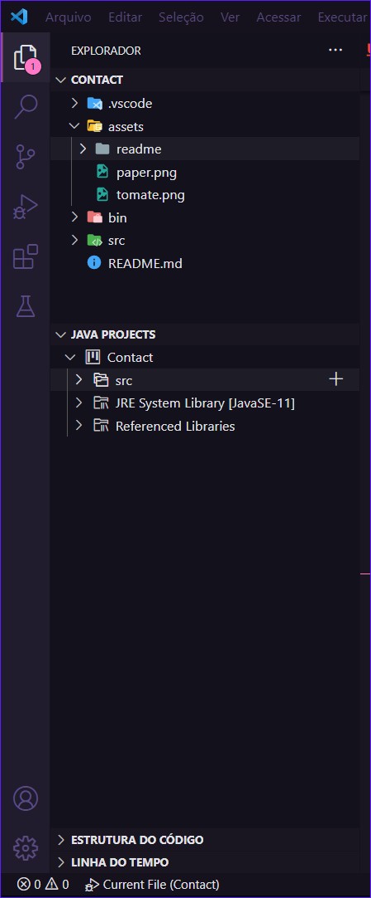
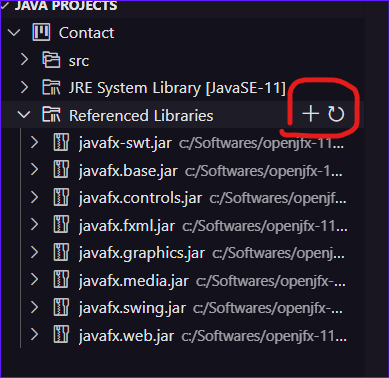

# Atividade Avaliativa

Para a realização da terceira avaliação decidir fazer duas interfaces de aplicações simples usando o JavaFX, pois já possuia conhecimento na criação de interfaces com o mesmo.

Foi desenvolvido uma aplicação simples de To-do e uma aplicação muito simples de Pomodoro.

## Desenvolvedores 
 - **Aluno** : João Felipe de Oliveira Souza;
 - **Matricula**: 201800109927;
 
## Pomodoro

O pomodoro é uma técnica de estudo ou concentração com breves intervalos de tempo para descanço que busca o máximo de produtividade. No pomodoro que foi desenvolvido tem somente o momento de concentração e o momento de pausa curta.

## To-Do

Uma aplicação "To-Do", ou lista de tarefas, é uma ferramenta utilizada para gerenciar e organizar tarefas e compromissos. Ela é projetada para ajudar as pessoas a acompanhar o que precisa ser feito, definir prioridades e concluir suas tarefas de forma eficiente. 

## Dicas de instalação

Para que executar o código do projeto recomendo utilizar o VSCode e seguir próximos passos:

  - Descompacte o zip Lib.zip em uma pasta fora do projeto, de preferência diretamente no disco C; 
  - Vá em JAVA PROJECTS (veja a imagem 1);
  - Em "Referenced Libraries" clique no "+"(Veja a imagem 2);
  - Adiciones os JAR do JavaFX;
  - Execute o arquivo App.java em src;

  
  imagem 1
  

  
  imagem 2

## Demonstração

